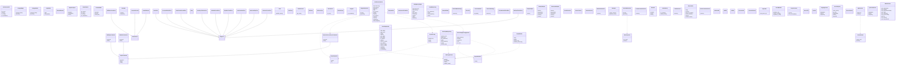

# Diagramme class — version 10 du graphe

```mermaid
classDiagram
    class ArchitectureDiff {
        +by_type()
        +counts()
        +is_empty()
        +to_markdown()
    }
    class ChangedEdge {
        +changed_fields()
        +describe()
    }
    class ChangedNode {
        +changed_fields()
        +describe()
    }
    class GraphDiffer {
        +diff()
        +diff_graphs()
    }
    class ChangeRequest
    class ImpactAnalyzer {
        +analyze()
        +candidates()
        +locate()
    }
    class ImpactReport {
        +all_nodes()
        +by_type()
        +is_empty()
        +to_markdown()
    }
    class CommandBus {
        +execute()
        +history()
        +undo_last()
    }
    class NothingToUndoError
    class AddEdgeCommand {
        +execute()
        +undo()
    }
    class AddNodeCommand {
        +execute()
        +undo()
    }
    class GraphCommand {
        +execute()
        +label()
        +undo()
    }
    class ReplaceObservedLayerCommand {
        +execute()
        +undo()
    }
    class DomainEvent
    class EventBus {
        +publish()
        +subscribe()
    }
    class GraphChanged
    class ProposalCreated
    class ValidationCompleted
    class ArchitectureService {
        +dependencies()
        +dependents()
        +diagram()
        +diff()
        +for_project()
        +graph()
        +impact()
        +init_project()
        +reverse()
        +search()
        +snapshots()
        +write_diagram()
    }
    class UnknownFocusError
    class Edge
    class DuplicateEdgeError
    class DuplicateNodeError
    class EdgeNotFoundError
    class NodeNotFoundError
    class OntologyViolationError
    class SakgError
    class SnapshotNotFoundError
    class Node {
        +qualified_name()
    }
    class NodeType
    class NodeResolver {
        +get_node()
    }
    class OntologySchema {
        +default()
        +is_allowed()
        +triples()
        +validate_edge()
    }
    class Evidence
    class EvidenceType
    class Provenance {
        +is_fact()
    }
    class RelationType
    class Diagram {
        +to_markdown()
    }
    class DiagramGenerator {
        +format()
        +generate()
    }
    class MermaidGenerator {
        +format()
        +generate()
    }
    class DiagramView
    class UnsupportedViewError
    class ViewProjection {
        +for_view()
        +project()
    }
    class KnowledgeGraph {
        +add_edge()
        +add_node()
        +copy()
        +edges()
        +get_edge()
        +get_node()
        +in_edges()
        +nodes()
        +nodes_of_type()
        +out_edges()
        +remove_edge()
        +remove_node()
        +schema()
        +subgraph()
        +to_networkx()
    }
    class GraphQueryEngine {
        +dependencies()
        +dependents()
        +find()
        +get_node()
        +inventory()
        +nodes()
        +path()
        +traverse()
    }
    class GraphRepository {
        +list_snapshots()
        +load()
        +load_snapshot()
        +save()
    }
    class GraphSnapshot {
        +meta()
        +of()
    }
    class SnapshotMeta
    class BoundedBfsStrategy {
        +traverse()
    }
    class Direction
    class TraversalResult {
        +at_depth()
    }
    class TraversalStrategy {
        +traverse()
    }
    class ProjectConfig {
        +default_for()
        +load()
        +save()
    }
    class ProjectNotInitializedError
    class CorruptedGraphError
    class JsonGraphRepository {
        +architect_dir()
        +graph_dir()
        +list_snapshots()
        +load()
        +load_snapshot()
        +save()
        +versions_dir()
    }
    class EndpointSpec {
        +name()
    }
    class FastApiAdapter {
        +detect()
        +framework()
        +inclusions()
        +routers()
        +routes()
    }
    class FrameworkAdapter {
        +detect()
        +framework()
        +inclusions()
        +routers()
        +routes()
    }
    class RouteExtraction
    class RouterContext
    class RouterInclusion
    class DatabaseExtractor {
        +extract()
    }
    class TableSpec {
        +column_names()
        +qualified_name()
    }
    class ApiExtractor {
        +adapters()
        +extract()
    }
    class CodeStructureExtractor {
        +extract()
    }
    class Extractor {
        +extract()
        +name()
        +order()
    }
    class ModuleEntry {
        +is_package()
        +module_name()
    }
    class NameResolver {
        +resolve()
    }
    class ProjectIndex {
        +add()
        +entries()
        +entry_of_module()
        +knows_module()
        +locate()
        +resolve_export()
    }
    class RouterMounts {
        +context_for()
        +resolve()
    }
    class GraphBuilder {
        +add()
        +build()
        +merge_into()
        +resolve_references()
    }
    class InfrastructureExtractor {
        +extract()
    }
    class AttributeRef
    class CallRef
    class CallSite
    class DecoratorRef
    class ExtractionResult
    class ImportRef {
        +local_name_of()
    }
    class ParsedModule {
        +attributes_of()
        +imports_module()
        +symbols_of_kind()
    }
    class ProjectContext {
        +covers()
        +files_of_language()
    }
    class SourceFile
    class Symbol
    class LanguageParser {
        +language()
        +parse()
        +supports()
    }
    class ParserRegistry {
        +clear_cache()
        +for_file()
        +languages()
        +parse()
        +register()
    }
    class ReverseEngineeringPipeline {
        +add_extractor()
        +default()
        +extractors()
        +run()
        +run_on()
    }
    class ReverseResult
    class ParseError
    class PythonAstParser {
        +language()
        +parse()
        +supports()
    }
    class ModuleVisitor {
        +visit_AnnAssign()
        +visit_Assign()
        +visit_AsyncFunctionDef()
        +visit_Call()
        +visit_ClassDef()
        +visit_FunctionDef()
        +visit_If()
        +visit_Import()
        +visit_ImportFrom()
    }
    class ProjectScanner {
        +scan()
    }
    NothingToUndoError --|> SakgError
    AddEdgeCommand --|> GraphCommand
    AddNodeCommand --|> GraphCommand
    ReplaceObservedLayerCommand --|> GraphCommand
    GraphChanged --|> DomainEvent
    ProposalCreated --|> DomainEvent
    ValidationCompleted --|> DomainEvent
    UnknownFocusError --|> SakgError
    DuplicateEdgeError --|> SakgError
    DuplicateNodeError --|> SakgError
    EdgeNotFoundError --|> SakgError
    NodeNotFoundError --|> SakgError
    OntologyViolationError --|> SakgError
    SnapshotNotFoundError --|> SakgError
    CorruptedGraphError --|> SakgError
    ParseError --|> SakgError
    ArchitectureService ..> ReverseEngineeringPipeline
    ArchitectureService ..> ProjectConfig
    ArchitectureService ..> ReplaceObservedLayerCommand
    ArchitectureService ..> GraphSnapshot
    MermaidGenerator ..> ViewProjection
    KnowledgeGraph ..> OntologySchema
    JsonGraphRepository ..> OntologySchema
    JsonGraphRepository ..> GraphSnapshot
    ApiExtractor ..> RouterMounts
    GraphBuilder ..> OntologySchema
    ReverseEngineeringPipeline ..> OntologySchema
    ReverseEngineeringPipeline ..> ProjectScanner
```
